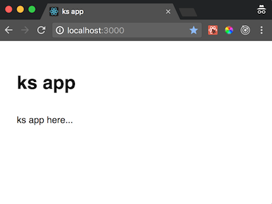

# Kubernetes series part 1

The objective here is to create a minimal react app and run it in a kubernetes cloud server.

## Build a React app

* we start with a react application similar to the result of [create react app](https://github.com/facebookincubator/create-react-app) as our baseline.

1. navigate to ks1

    ```bash
    ➜ pwd
        ~/dev/github/redgate/ks/ks1
    ```

1. build app

    ```bash
    ➜ cd ./app
    ➜ yarn
        yarn install v1.1.0
        [1/4] 🔍  Resolving packages...
        [2/4] 🚚  Fetching packages...
        [3/4] 🔗  Linking dependencies...
        [4/4] 📃  Building fresh packages...
        success Saved lockfile.
        ✨  Done in 2.92s.
    ➜ yarn start
        Compiled successfully!

        You can now view app in the browser.

        Local:            http://localhost:3000/
        On Your Network:  http://192.168.0.6:3000/

        Note that the development build is not optimized.
        To create a production build, use yarn build.
    ```

    This should serve your website at `http://localhost:3000/`

    

## Move app into kubernetes

1. create apps Dockerfile

    The docker image is based on the following docker file
    File: `./ks1/web/Dockerfile`

    ```dockerfile
    FROM node:8.6.0
    
    ADD ./app /app
    
    WORKDIR /app
    
    EXPOSE 3000
    
    RUN \
        if [ -d node_modules ]; then \
          rm -R node_modules; \\
        fi && \
        yarn install && \
        yarn
    
    CMD ["yarn", "start"]
    ```

2. create the docker image and upload it to your private registry.

    ```bash
    docker build -f ./web/Dockerfile -t <your-namespace>/ks:v1 . && \
    docker login registry.<your_registry>.com && \
    docker tag <your-namespace>/ks:v1 registry.<your_registry>.com/<your-namespace>/ks:v1 && \
    docker push registry.<your_registry>.com/<your-namespace>/ks:v1
    ```

3. create kubernetes deployment file, see `./ks1/config/deployment.yaml`

4. create kubernetes service file, see `./ks1/config/service.yaml`

5. create kubernetes ingress file, see `./ks1/config/ingress.yaml`

6. use kubectl to launch/create the pods

    ```bash
    ➜ kubectl create -f ./config/deployment.yaml
    deployment "ks1" created

    ➜ kubectl create -f ./config/service.yaml
    service "ks1" created
 
    ➜ kubectl create -f ./config/ingress.yaml
    ingress "ks1" created
    ```

7. Check cluster status, example output:

    ```bash
    kubectl get deployment ks1 -o wide
 
    NAME      DESIRED   CURRENT   UP-TO-DATE   AVAILABLE   AGE       CONTAINERS   IMAGES                                   SELECTOR
    ks1     1         1         1            1           6m        ks1        registry.codinghere.com/smoloney/ks:v1   app=ks1
    ```

    ```bash
    kubectl get service ks1 -o wide
 
    NAME      TYPE        CLUSTER-IP     EXTERNAL-IP   PORT(S)   AGE       SELECTOR
    ks1     ClusterIP   10.105.17.56   <none>        80/TCP    9m        app=ks1
    ```

    ```bash
    kubectl get ingress ks1 -o wide
 
    NAME      HOSTS                       ADDRESS   PORTS     AGE
    ks1     ks1.185.80.184.161.nip.io             80        10m
    ```

    ```bash
    kubectl get pod --selector app=ks1 -o wide
 
    NAME                   READY     STATUS    RESTARTS   AGE       IP           NODE
    ks1-78f6559cf6-b2t76   1/1       Running   0          2m        10.244.1.4   kubenow-cluster-node-001
    ```

8. check web logs

    ```bash
    ➜ kubectl logs ks1-78f6559cf6-b2t76
 
    Starting the development server...
    
    Compiled successfully!
    
    You can now view app in the browser.
    
      Local:            http://localhost:3000/
      On Your Network:  http://10.244.1.4:3000/
    
    Note that the development build is not optimized.
    To create a production build, use yarn build.
    ```
    
    As `http://10.244.1.4:3000` is an internal network address for the kubernetes cluster,
    this is effectively unreachable and redundant.
    
    The server serving on `http://localhost:3000/` will have it's requests proxied through
    the ingress controller and will be served publically at the declared host address which 
    was `ks1.185.80.184.161.nip.io` - where `185.80.184.161.nip.io` is the public domain and
    `ks1` is a subdomain. 


9. delete app

    To delete deployment and service:

    ```bash
    kubectl delete -f ./config/deployment.yaml
    kubectl delete -f ./config/service.yaml
    kubectl delete -f ./config/ingress.yaml
    ```

    To delete image (locally)

    ```bash
    docker rmi smoloney/ks:v1
    ```
    